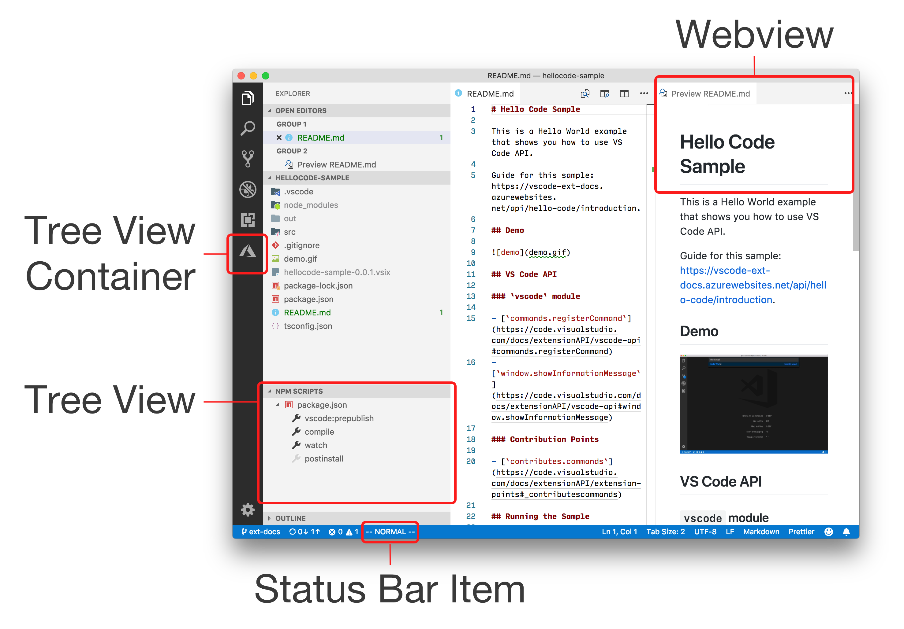

# 插件在 VSCode 中能做什么

- 显示
  - 自定义主题
  - 活动栏项目
  - 显示提示框
  - 状态栏信息
  - 显示进度条
  - 添加菜单项
  - 打开文件
  - 从文本输入框获取输入(QuickPick)
  - 显示网页(web view)
- 配置
  - 添加命令
  - 添加配置项
  - 添加快捷键
  - 添加右键菜单
  - 存储数据(localStorage)
- 编程
  - 实现新语言的高亮
  - 实现新语言的调试器
  - 代码库管理
  - 定义和执行 Task
  - 定义 snippet

因为由 web view 并且底层是 node.js 虽然官方不推荐，但是实际是可以做到非常多的事情。

另外底层的 Electron 是阉割版的，如果需要的功能没有，也可以下载官方的 Electron 替换掉 VSCode 中的版本。

# 如何编写插件

## 编程语言

至少需要 Javascript 或 Typescript 来做入口。

除了入口必须用 JS 或 TS，具体实现完全可以用你熟悉的任何语言，只要在 VSCode 的电脑上可以执行。

例如 Java Language Server 插件的大部分功能都是由 Java 实现的，插件和 Java 代码之间通过 json-RPC 来进行通信。

下面是 mssql 的架构和数据流：

https://github.com/Microsoft/vscode-mssql/wiki/architecture

