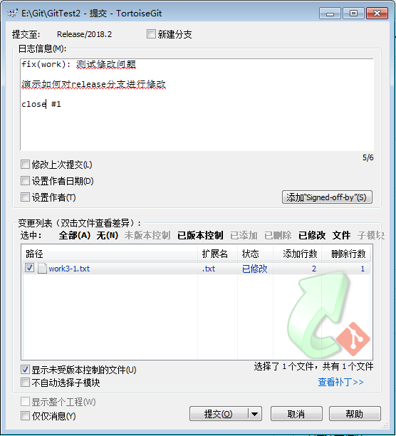
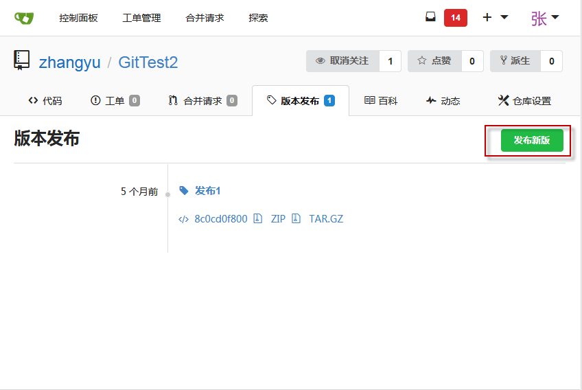
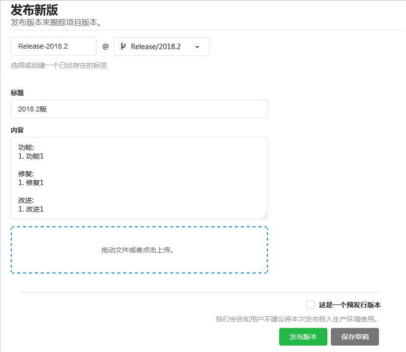
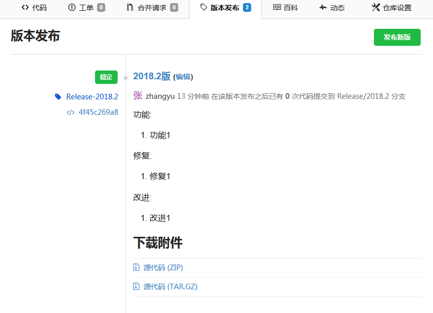
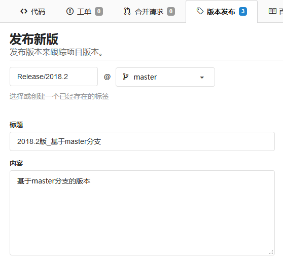
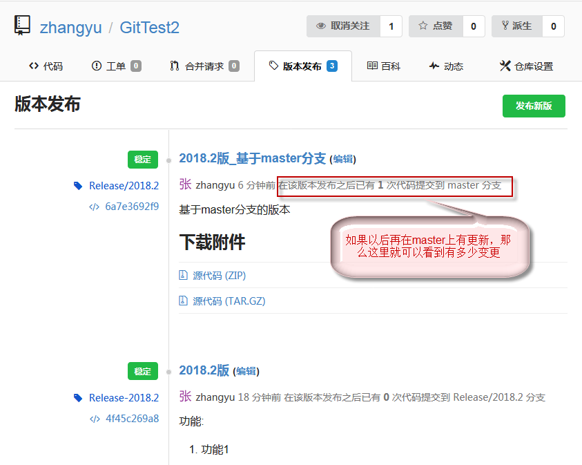

# 使用gitea发布版本

## 预发布和测试

### 检出到Release分支

.png)

### 测试和解决问题

### 提交到服务器(也可以合并到master分支中)

将release分支提交到服务器后，就可以通过这个分支来建立一个标签了。

也可以在本地也可以建立标签后直接将标签提交到服务器，但是这种方法在服务器上能显示的信息就比较少了，并且不能将构建好的软件也加入发布连接中，所以不用这种方式。

.png)

## 正式发布版本

使用版本发布页面的“发布版本”功能。

### 通过release分支创建版本发布

上面的是标签名称，名称根据版本规则填写即可。下面的是版本信息，在内容时，建议在填写变更记录。

### 通过release发布的结果

通过release分支发布版本的坏处在于，以后这个分支基本不动，所以最新代码有任何改动，这个版本信息中是无法查看的。

### 通过master分支创建版本发布

通过master分支发布版本的好处在于以后提交内容到master后，在这个发布版本上就能看的有多少内容在该版本发布后提交到master了。

### 通过master发布的结果

